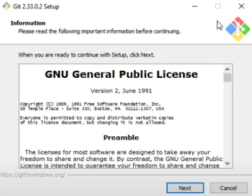
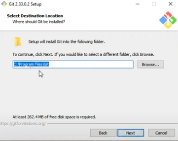
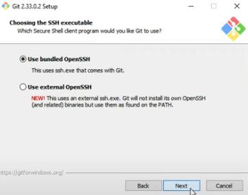
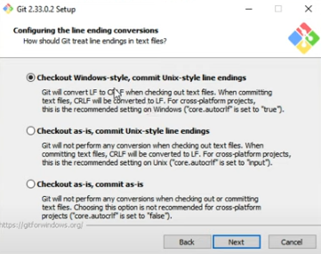

# Git Setup
This is the step-by-step instructions of how to set Git.

This setup will be done for the Windows OS, but the steps should remain relatively the same for other operating systems.

Using commands on the terminal makes me feel really cool and smart, but it is not as user-friendly as the GUI for Git through Github Desktop. If you feel up to it, follow along and use the command line, otherwise, there's no harm is using the tools someone else built to make our lives as developers easier.
## Installation
**Note**: This guide is for installing the git for command-line usage.
1. Navigate to this [link](https://git-scm.com/downloads) and click on your operating system followed by the download button  

2. For Windows, you want to choose whichever bit (32 or 64) your computer is operating at.  

3. Run the installer  
4. Accept the license  

5. Choose an installation location  

6. Leave the checkboxes as default  

7. Choose a Start Menu Folder (Default is fine)  
8. Choose let Git decide (shouldn't matter though)  

9. Choose Git from the command line  

10. Choose Use bundled OpenSSH  

11. Choose Use the OpenSSL Library  

12. Choose Checkout Windows-Style  

13. Choose Use Windowes' default console window  
14. Choose Default  

15. Choose Git Credential Manager Core  

16. Choose Enable file system caching  

17. Select none  

18. Install and all should be finished. You can open up PowerShell, cmd, MinTTY, or any terminal and type in **git** and you should see a similar result if all was installed successfully.  

